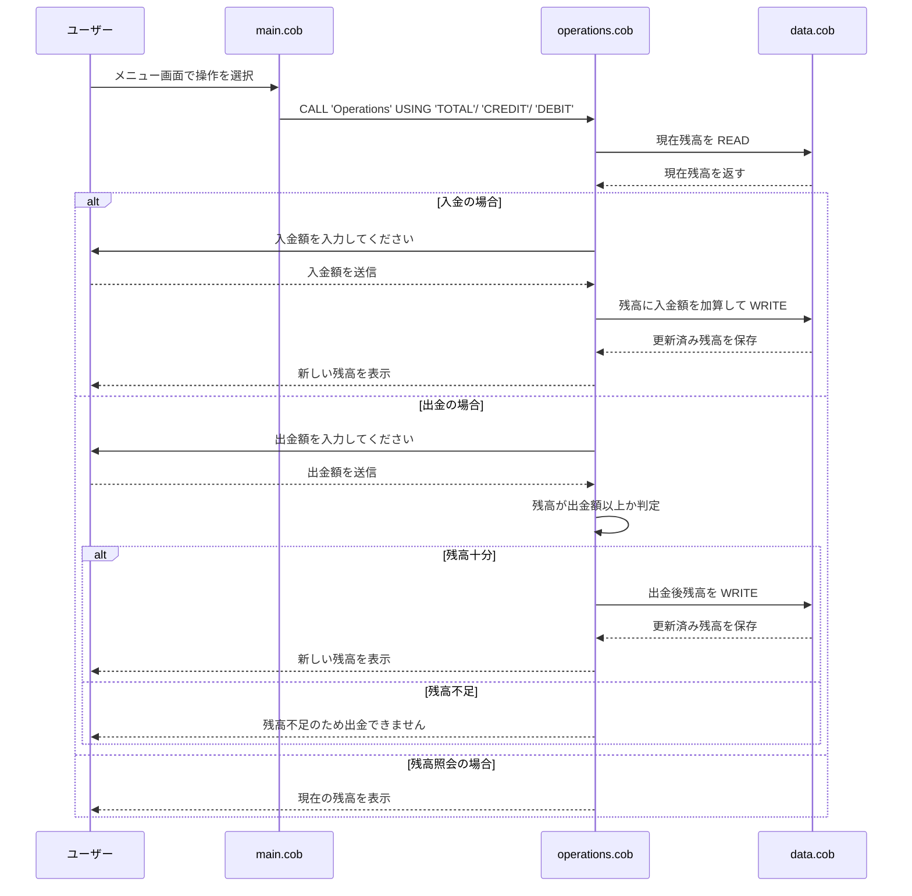

# COBOL Legacy System Documentation

このドキュメントでは、`src/cobol` 配下の COBOL プログラムと、それぞれの役割、主要な機能、学生アカウントに関連する業務ルールについて説明します。

## 1. main.cob

### 目的
`main.cob` はアプリケーションのエントリーポイントです。ユーザーに対してメニューを表示し、残高照会、入金、出金の各操作を選択できるようにします。

### 主要な機能
- メニュー表示
- ユーザー入力の受け取り
- 選択された操作に応じた `Operations` プログラムの呼び出し
- 終了処理

### 学生アカウント関連業務ルール
- ユーザーは 1〜4 の選択肢から操作を選ぶ
- `4` を選択するとプログラムを終了する
- その他の入力は無効としてエラーメッセージを表示する

## 2. operations.cob

### 目的
`operations.cob` は各種口座操作の制御を担当します。残高照会、入金、出金のビジネスロジックを実装し、実際のデータアクセスを `DataProgram` に委譲します。

### 主要な機能
- `TOTAL` で残高照会
- `CREDIT` で入金処理
- `DEBIT` で出金処理
- `DataProgram` への `READ` / `WRITE` 呼び出し

### 学生アカウント関連業務ルール
- `TOTAL` の場合は現在の残高を読み取って表示する
- `CREDIT` の場合は入金額を受け取り、残高を加算して保存する
- `DEBIT` の場合は出金額を受け取り、残高が不足していないことを確認してから引き落とす
- 残高不足時には出金を拒否し、エラーメッセージを表示する

## 3. data.cob

### 目的
`data.cob` は口座残高の保存と読み出しを担当するデータアクセスロジックです。`Operations` から渡された命令に従って、残高を読み出したり更新したりします。

### 主要な機能
- `READ` で内部の `STORAGE-BALANCE` を呼び出し元に渡す
- `WRITE` で呼び出し元から受け取った残高を `STORAGE-BALANCE` に反映する

### 学生アカウント関連業務ルール
- 口座残高はプログラム内の `STORAGE-BALANCE` で管理される
- `READ` は常に現在の残高を返す
- `WRITE` は更新された残高を保存し、次の参照時に反映される
- 最初の初期残高は `1000.00` に設定される

## 全体像
このシステムは学生アカウント向けの基礎的な口座管理システムで、次の点を重視しています。

- メニュー型の対話式操作
- 残高の照会、入金、出金の基本機能
- 残高不足時の出金制限
- データアクセスとビジネスロジックの分離

必要に応じて、将来的には学生アカウント固有の追加業務ルール（例: 月間取引回数制限、学生証番号による認証、口座分類ごとの手数料適用など）を拡張できます。

## シーケンス図

